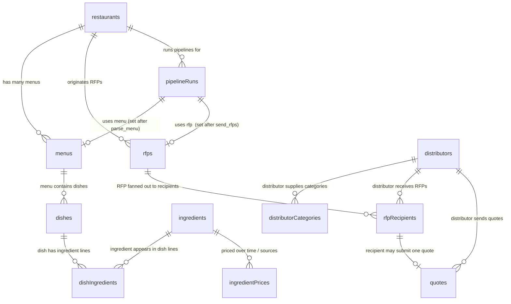

# Convex Schema — Pathway RFP Pipeline

The single source of truth is `convex/schema.ts`. This document is the human-readable view: an ER diagram and one-line annotations per relationship/index. Update this when `schema.ts` changes.

## ER diagram

## Tables and indexes

### `restaurants`
Root entity. No indexes — looked up by id from `pipelineRuns.restaurantId`.

### `menus`
- `restaurantId` → many menus per restaurant (re-uploads/iterations).
- idx `by_restaurantId` — "all menus for restaurant X".

### `dishes`
- `menuId` → many dishes per menu.
- idx `by_menuId` — "all dishes in this menu".

### `ingredients` (deduplicated master)
- `canonicalName` is normalized (singular, lowercased, brand/cultivar stripped).
- idx `by_canonicalName` — upsert lookup at parse time (the dedup hook).
- idx `by_category` — UI filter / agent grouping by category.

### `dishIngredients` (JOIN)
Many-to-many dish↔ingredient with per-occurrence quantity/unit/confidence.
- idx `by_dishId` — "ingredients in this dish".
- idx `by_ingredientId` — "which dishes use this ingredient".
- idx `by_dish_and_ingredient` *(composite)* — idempotency key for re-parsing the same menu.

### `ingredientPrices`
Time-series; one row per `(ingredientId, source, reportDate)`.
- idx `by_ingredientId` — "all prices for this ingredient".
- idx `by_ingredient_and_reportDate` *(composite)* — supports "latest price for ingredient" and idempotent upsert during `fetch_pricing`.

### `distributors`
- `source` discriminates real Places results from seeded mocks.
- idx `by_source` — "show me all mocks" / quota tracking.
- idx `by_externalId` — Places `place_id` dedup on re-discovery.

### `distributorCategories` (JOIN — what categories a distributor supplies)
A row per `(distributorId, category)`. We model supply as a join table rather than an array on `distributors` because **arrays are not indexable in Convex**, and we need fast "which distributors carry X".
- idx `by_distributorId` — "categories this distributor covers".
- idx `by_category` — "distributors that carry meat".
- idx `by_category_and_distributor` *(composite)* — dedup writes + ordered listing.

### `rfps`
- idx `by_restaurantId` — "all RFPs from this restaurant".
- idx `by_status` — the agent cron scans `status="collecting"` to find RFPs that need follow-up or closure.

### `rfpRecipients` (JOIN)
The fan-out from one RFP to N distributors. Owns the per-distributor email lifecycle.
- idx `by_rfpId` — "all recipients of this RFP".
- idx `by_distributorId` — "RFP history for this distributor".
- idx `by_rfp_and_distributor` *(composite)* — send idempotency key.
- idx `by_replyAddress` — **every inbound Maileroo webhook hits this index** to route a reply back to the originating recipient row; must be O(1).
- idx `by_sentMessageId` — bounce-handling lookup (Maileroo references the original `message_id`).

### `quotes`
At most one quote per recipient row (semantically; not DB-enforced).
- idx `by_rfpRecipientId` — "the quote for this recipient" / dedup write check.
- idx `by_distributorId` — "all quotes from this distributor over time".
- idx `by_mailerooMessageId` — **inbound idempotency** — duplicate webhook deliveries are no-ops.

### `pipelineRuns`
Drives the live UI. Embedded `steps[]` array (ordered, length 5) means a single subscription powers the whole timeline.
- idx `by_restaurantId` — "most recent run for restaurant" + history.

## Enums

| enum | values |
|---|---|
| `category` | produce, dairy, meat, seafood, pantry, other |
| `confidence` | high, medium, low |
| `step` | parse_menu, fetch_pricing, find_distributors, send_rfps, collect_quotes |
| `stepStatus` | pending, running, done, error |
| `currentStep` | *(step values)* + done, error |
| `menus.sourceType` | url, image, text |
| `ingredientPrices.source` | usda_mars, usda_nass, estimated, mock |
| `distributors.source` | google_places, mock |
| `rfps.status` | draft, sent, collecting, closed |
| `rfpRecipients.emailStatus` | queued, sent, replied, followed_up, failed |

## Idempotency keys (cross-reference)

| stage | natural key | index |
|---|---|---|
| parse_menu | `(restaurantId, menuId)` → reuse `menus` row when `parsedAt != null`; reuse `dishes` + `dishIngredients` via `by_dish_and_ingredient` | `menus.by_restaurantId`, `dishIngredients.by_dish_and_ingredient` |
| fetch_pricing | `(ingredientId, reportDate)` upsert | `ingredientPrices.by_ingredient_and_reportDate` |
| find_distributors | `(source, externalId)` upsert | `distributors.by_externalId` |
| send_rfps | `(rfpId, distributorId)` — only send when `emailStatus="queued"` | `rfpRecipients.by_rfp_and_distributor` |
| collect_quotes (inbound) | `mailerooMessageId` | `quotes.by_mailerooMessageId` |
| inbound routing | `replyAddress` | `rfpRecipients.by_replyAddress` |
